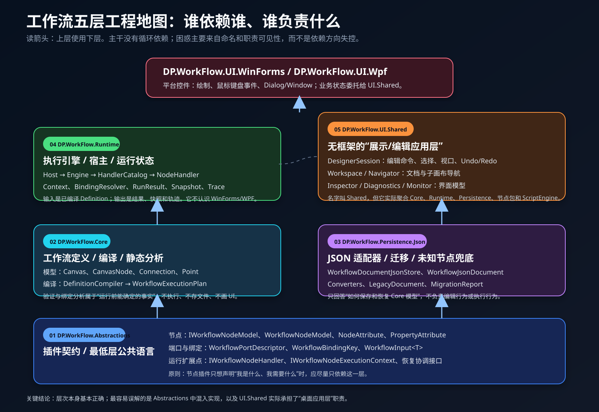
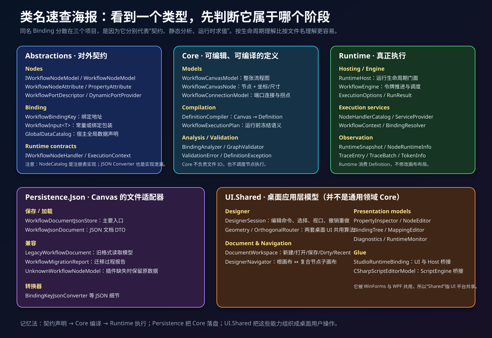
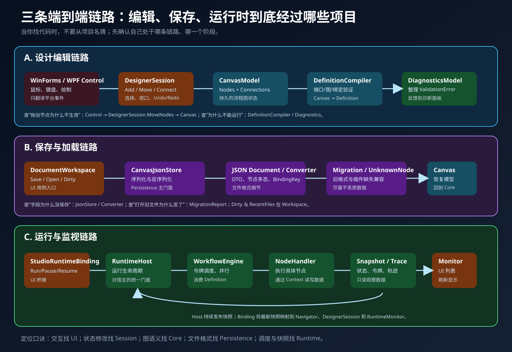
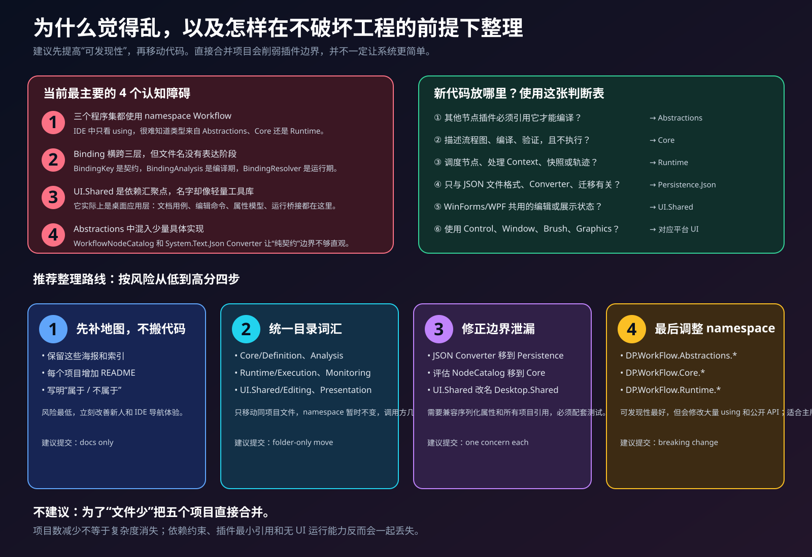

# DP.WorkFlow 架构解释海报

这组海报用于解释以下五个容易混淆的工程：

- `DP.WorkFlow.Abstractions`
- `DP.WorkFlow.Core`
- `DP.WorkFlow.Runtime`
- `DP.WorkFlow.Persistence.Json`
- `DP.WorkFlow.UI.Shared`

## 海报索引

### 1. 项目依赖与职责

[打开原始 SVG](01-project-dependencies.svg)



### 2. 类名速查图

[打开原始 SVG](02-class-atlas.svg)



### 3. 编辑、保存、运行的端到端链路

[打开原始 SVG](03-end-to-end-flows.svg)



### 4. 混乱来源与渐进整理路线

[打开原始 SVG](04-cleanup-roadmap.svg)



## 一句话理解

```text
Abstractions  定义插件和节点必须共同遵守的契约
      ↓
Core          保存流程图语义，并把 Canvas 编译成 Definition
      ↓
Runtime       执行 Definition，产生 Result、Snapshot 和 Trace

Persistence.Json  负责 Core Canvas 与 JSON 文件之间的转换
UI.Shared         把上述能力编排成桌面设计器可使用的编辑和展示模型
```

## 当前架构是否需要推倒重来？

不需要。当前依赖主干是单向的：

```text
Abstractions
    ↑
Core
    ↑             ↑
Runtime      Persistence.Json
    ↑             ↑
       UI.Shared
           ↑
  WinForms / WPF
```

主要问题是**可发现性**而不是循环依赖：

1. `Abstractions`、`Core`、`Runtime` 大量类型都使用同一个 `DP.WorkFlow` namespace。
2. `Binding` 分布在契约、编译分析和运行求值三个阶段。
3. `UI.Shared` 实际是桌面应用层依赖汇聚点，但名称容易让人误以为它只是轻量 UI 工具库。
4. `Abstractions` 中存在 `WorkflowNodeCatalog`、JSON Converter 等少量具体实现。

建议先保留工程边界，通过 README、目录命名和架构图改善理解，再逐步处理边界泄漏；不要直接把五个程序集全部合并。
